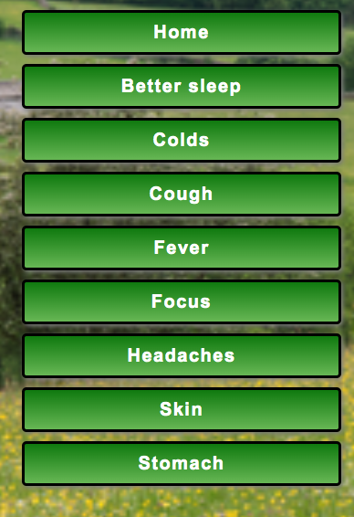
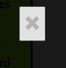

# teas-for-health
Description of flowers, plants and spices which you can use as an tea or part of your diet, and what health benefits it holds. I also tried to add some possible side effects they may hold. So in case you have some more serious health problems, I suggest to consult with your family medicine docots before adding them in your diet.
# [Hearbs and teas for health](https://healthherbteas.com/)

Ever since childhood during spring or summer in our countryside me and relatives would go out in the fields to collect various plants and dry them for later use in teas. So Since then I knew the benefits of few of them, recently been "digging" a little deeper into them, and found some valuable information about them, and apparently for those plants are even more uses as I thought. And interestinly enough, many of them can be grown at home/ garden as well. All that tips I've found included into website - what spot, soil it prefers and when would bt the best time for harvesting.

## UX

The idea of website was created as a little challenge for myself, as there are now added several things I never tried before, such as side bar (in one of previous pages I did only horizontal with "hamburger" dropdown menu), decided to try on funcional searchbar and also adding modals to images, which I think was hardest bit for me to fully figure out. 

### Colour Scheme

Homepage: red for highlighted text, yellow for highlighted background, lavanderblush for main text, rgba(166, 237, 175, 0.6) for backup background colour ||
Better sleep: #6ae7f3 and #99aef2 for background colour and black for text. ||
Colds: lightcoral and lightpink for background and black for text. ||
Cough: lightgreen and yellowgreen for background colour and black for text. ||
Fever: grey and lightgrey as background colour and black for text. ||
Focus: rgb(221,170,187) and rgb(173,116,135) for background and default (black) for text. ||
Headaches: rgb(124,164,85) and rgb(183,240,125) for background colour and default for text. ||
Skin: gold and rgb(231,213,112) background and default text. ||
Stomach: rgb(208,154,54) and orange background and default text. ||

### Typography

For home page I have used font Ariel and sans serif as a back-up.
All the rest of pages has default font. 

## Features

Sidebar, searchbar, footer, modals for each image.

### Existing Features

- **Navbar section #1**

  A chance for people to navigate through pages.

- **Searchbar for quicker item sindings #2**

    This is to give a chance to people to find particular item withouth going through all pages.

- **Image  #3**

Added images in pages, so the website looks more pleasing and people would know how the said item looks likeimages.

- **Footer  #4**

A chance for people to know when the page was created.

- **Modal items  #5**

Giving a chance to zoom in images for better look at them.

- **Modal close button  #6**

An easier way to close opened modal images

### Future Features

- More plants, herbs etc #1
    - Adding more items as there are still plenty to cover with various health benefits.
- Adding star rating system #2
    - To give a chance to customers to rate each item depending if they found information/said item useful and helpful.
-  Coment section #3
    - To give a chance to customers to coment used items.
- Return of translate option#4

## Deployment

The site was deployed to GitHub Pages. The steps to deploy are as follows:

- In the [GitHub repository](https://github.com/Boka-Krista/teas-for-health), navigate to the Settings tab 
- From the source section drop-down menu, select the **Main** Branch, then click "Save".
- The page will be automatically refreshed with a detailed ribbon display to indicate the successful deployment.

The live link can be found [here](https://boka-krista.github.io/teas-for-health/)

## Tools & Technologies Used

- [HTML](https://en.wikipedia.org/wiki/HTML) used for the main site content.
- [CSS](https://en.wikipedia.org/wiki/CSS) used for the main site design and layout.
- [Git](https://git-scm.com) used for version control. (`git add`, `git commit`, `git push`)
- [GitHub](https://github.com) used for secure online code storage.
- [Bootstrap](https://getbootstrap.com) used as the front-end CSS framework for modern responsiveness and pre-built components.
- [JavaScript](https://simple.wikipedia.org/wiki/JavaScript)
## Deployment

The site was deployed to GitHub Pages. The steps to deploy are as follows:

- In the [GitHub repository](https://github.com/Boka-Krista/teas-for-health), navigate to the Settings tab 
- From the source section drop-down menu, select the **Main** Branch, then click "Save".
- The page will be automatically refreshed with a detailed ribbon display to indicate the successful deployment.

The live link can be found [here](https://boka-krista.github.io/teas-for-health/)

### Local Deployment

This project can be cloned or forked in order to make a local copy on your own system.

#### Cloning

You can clone the repository by following these steps:

1. Go to the [GitHub repository](https://github.com/Boka-Krista/teas-for-health) 
2. Locate the Code button above the list of files and click it 
3. Select if you prefer to clone using HTTPS, SSH, or GitHub CLI and click the copy button to copy the URL to your clipboard
4. Open Git Bash or Terminal
5. Change the current working directory to the one where you want the cloned directory
6. In your IDE Terminal, type the following command to clone my repository:
	- `git clone https://github.com/Boka-Krista/teas-for-health.git`
7. Press Enter to create your local clone.

Alternatively, if using Gitpod, you can click below to create your own workspace using this repository.

Please note that in order to directly open the project in Gitpod, you need to have the browser extension installed.
A tutorial on how to do that can be found [here](https://www.gitpod.io/docs/configure/user-settings/browser-extension).

#### Forking

By forking the GitHub Repository, we make a copy of the original repository on our GitHub account to view and/or make changes without affecting the original owner's repository.
You can fork this repository by using the following steps:

1. Log in to GitHub and locate the [GitHub Repository](https://github.com/Boka-Krista/teas-for-health)
2. At the top of the Repository (not top of page) just above the "Settings" Button on the menu, locate the "Fork" Button.
3. Once clicked, you should now have a copy of the original repository in your own GitHub account!

### Local VS Deployment

Use this space to discuss any differences between the local version you've developed, and the live deployment site on GitHub Pages.

## Credits

Images been taken from google search about relevant plants, herbs and spices.
Information taken from various Google searches. 
Parts of the code been checked in bootstrap and w3shcools website.

